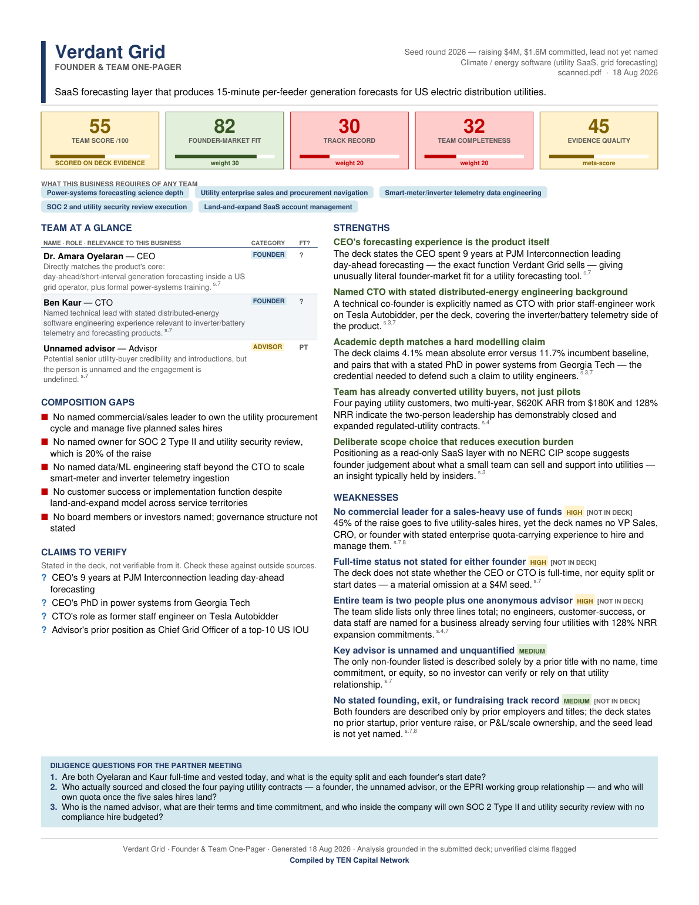
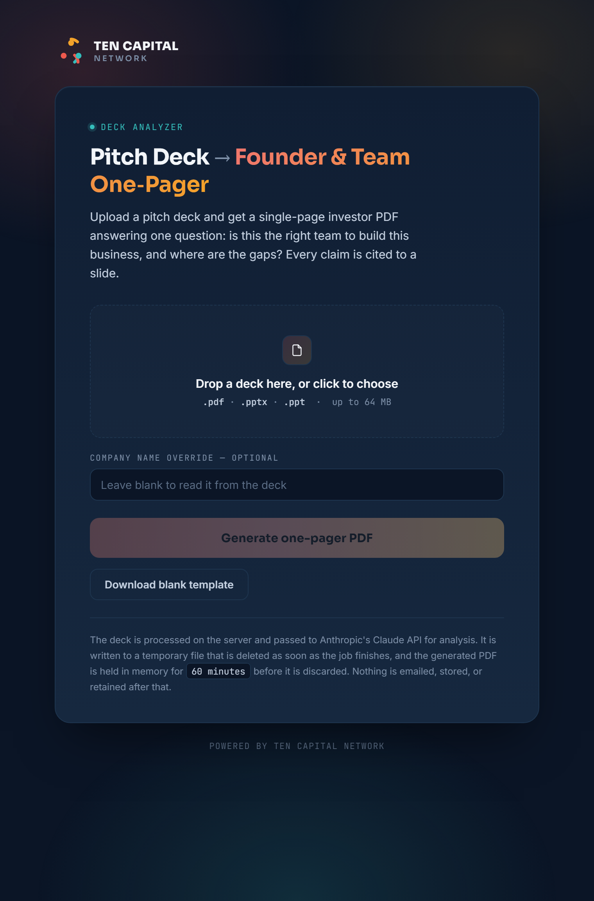

# deck-onepager

Turns an investor pitch deck into a **single-page, TEN Capital-branded founder & team
assessment**.

The output answers one question in under 90 seconds: *is this the right team to build this
specific business, and where are the gaps?*



---

## Install

Python 3.11 or newer.

```bash
git clone <this repo>
cd deck-onepager
python -m pip install -e ".[dev]"
```

Then set your API key:

```bash
cp .env.example .env
# edit .env and set ANTHROPIC_API_KEY
```

`.env` is gitignored. The key is read from the environment first, then from `.env` via
`python-dotenv`. No credential is ever written into the repo or into the output PDF.

Optional: install [LibreOffice](https://www.libreoffice.org/) if you need to analyze legacy
`.ppt` files or image-only `.pptx` decks — the tool shells out to `soffice --headless` to
convert them. Without it, `.pdf` and text-bearing `.pptx` still work; the tool detects the
absence and says so rather than failing obscurely.

---

## Use

```bash
onepager analyze samples/deck.pdf
```

Writes `./deck_Team_OnePager.pdf`.

### Flags

| Flag | Default | What it does |
|---|---|---|
| `DECK_PATH` | *(required)* | The deck: `.pdf`, `.pptx`, or `.ppt` |
| `-o`, `--output PATH` | `./<DeckStem>_Team_OnePager.pdf` | Where to write the one-pager |
| `--json PATH` | off | Also write the raw analysis JSON, for auditing or re-rendering |
| `--from-json PATH` | off | Render from a saved analysis JSON. **Makes no API call** |
| `--company TEXT` | off | Override the company name if extraction gets it wrong |
| `--model TEXT` | `$ANTHROPIC_MODEL`, else `claude-opus-5` | Model ID |
| `--max-slides INT` | `40` | Cap on slides sent to the model |
| `--vision` / `--no-vision` | auto | Send page images. Auto-detects image-based decks |
| `-v`, `--verbose` | off | Per-slide extraction stats, token usage, cost estimate |
| `--dry-run` | off | Print the payload that would be sent. **Makes no API call** |

`onepager template` takes `-o/--output` and `--json`, and makes no API call.

### The document template

```bash
onepager template -o onepager_template.pdf
```

Writes the blank one-pager — structure and field placeholders only, no company data.
It is rendered through the same layout engine as a real analysis, so it cannot drift
from what the app produces. See [docs/TEMPLATE.md](docs/TEMPLATE.md) for the zone-by-zone
structure spec and the full data contract.

### Typical workflow

Pay for the analysis once, then iterate on the layout for free:

```bash
onepager analyze deck.pdf --json analysis.json      # one API call
onepager analyze deck.pdf --from-json analysis.json # zero API calls, same PDF
```

The render path is fully independent of the analysis path, and the PDF is written in
ReportLab's invariant mode, so the same JSON produces a byte-identical PDF on the same day.

### Web app



```bash
python -m pip install -e ".[web]"
uvicorn onepager.web.app:app --port 8000
```

Upload a deck in the browser, watch progress, download the PDF and the analysis JSON.
Because an analysis takes 50-90s, uploads create a background job and the page polls.
Deployment to Railway is documented in [DEPLOY.md](DEPLOY.md).

| Route | Auth | Purpose |
|---|---|---|
| `GET /` | gated | Upload page |
| `GET /healthz` | open | Health check |
| `POST /api/jobs` | gated | Upload a deck, returns a job id |
| `GET /api/jobs/{id}` | gated | Poll status |
| `GET /api/jobs/{id}/pdf` | gated | Download the one-pager |
| `GET /api/jobs/{id}/json` | gated | Download the analysis JSON |
| `GET /api/template.pdf` | gated | The blank template |

Set `APP_PASSWORD` to gate everything but `/healthz` behind HTTP Basic. Leave it unset
only on localhost - a public URL without it lets anyone spend your API credit.

**Email delivery.** Set `RESEND_API_KEY` and every finished one-pager is emailed to
`RESEND_TO` (default `Info@tencapital.group`) with the PDF and analysis JSON attached.
The uploaded deck is never emailed. Delivery is a side channel: if it fails, the job
still succeeds and the reason appears in the results panel. Leave `RESEND_API_KEY`
unset to disable email entirely - the on-page disclosure updates itself to match.

### Exit codes

| Code | Meaning |
|---|---|
| `0` | Success |
| `2` | Unsupported, missing, encrypted, or corrupt file |
| `3` | Deck opened but yielded no analyzable content |
| `4` | API or authentication failure |
| `5` | Model returned unusable output after a retry |
| `6` | Render failed |

---

## Scoring

`team_score` is a 0–100 weighted composite of five subscores, each 0–100. **The composite is
computed in code from the subscores — the model never supplies the total.**

| Subscore | Weight | What it measures |
|---|---|---|
| `founder_market_fit` | 30 | Direct, demonstrated experience in this exact market and customer |
| `founder_product_fit` | 20 | Technical or domain depth to actually build this product |
| `track_record` | 20 | Prior exits, prior venture raises, prior P&L or scale ownership |
| `team_completeness` | 20 | Roster coverage vs. what this business model demands |
| `commitment_structure` | 10 | Full-time status, founder count, advisor-vs-operator ratio |

Score bands: **≥70 green · 40–69 amber · <40 red.**

### Evidence quality and the confidence gate

`evidence_quality` is a separate 0–100 **meta-score**: how much of the assessment rests on
stated deck content rather than on absence. It is not a component of `team_score`.

If `evidence_quality < 40`, the one-pager renders a **LOW CONFIDENCE** band on the score tile
and a red banner stating that the deck does not contain enough team information to score
reliably. This is enforced in `models.py` and `render/onepager.py`, not merely requested of the
model — a confident number on a thin deck is the single worst failure mode of this tool.

---

## Evidence discipline

Every substantive claim about a person carries a **slide number and a short verbatim quote**,
or is explicitly marked `NOT IN DECK`.

- Findings render their slide citations as a trailing superscript (`s.4,8`).
- Findings that report an *absence* get an outlined `[NOT IN DECK]` chip, so an investor can
  tell a gap in the team from a gap in the deck.
- `TeamAnalysis` rejects, at validation time, any finding with no citation that is not marked
  `is_absence`, and any named person with no citation whose full-time status is claimed.
- If the deck names no team, the tool returns an **empty roster** and absence findings. It does
  not assemble a team from scattered mentions.

The prompt asks for **five** strengths and five weaknesses, but the schema accepts **three to
five**. That floor is deliberate: forcing a fifth strength out of a deck that supports three is
exactly the pressure that produces invented content, and "never fabricate" outranks "always
five". In practice a real deck yields five; a thin one honestly yields fewer.

Note on determinism: current Claude models reject `temperature`, so the request does not set it.
Reproducibility comes from `--json` / `--from-json`, not from a sampling parameter.

---

## One page, structurally

The renderer draws onto a single canvas and calls `showPage()` exactly once, so a second page
is not reachable. The fit loop in `util/fitting.py` exists to make that page *complete* rather
than merely singular. When content overflows, it degrades in this fixed order, re-measuring
after each step:

1. Body font 8.5 → 8.0 → 7.5 pt
2. Leading and section spacing reduced 15%
3. Finding detail truncated to its first sentence
4. Team roster trimmed to 5 rows, then 4 (founders always kept first)
5. The 5th strength dropped, then the 5th weakness — never below 3 of each

Anything sacrificed is logged as a `WARNING` to stderr naming exactly what was dropped.

---

## Development

```bash
pytest          # test suite (195 tests, no API key or real deck required)
ruff check .    # lint
ruff format .   # format
```

The whole suite runs offline: fixtures synthesize a text PDF, an image-only PDF, and a
PPTX at test time, and the Anthropic client is mocked. `tests/test_cli.py` asserts that the
`--from-json` and `--dry-run` paths make no API call at all, and `tests/test_web.py`
drives the HTTP layer with the pipeline stubbed out. `tests/test_notify.py` covers email
delivery with the Resend call mocked, so no mail is sent while testing.

---

## Limitations

**This tool reads only the submitted deck.** It makes no network calls other than to the
Anthropic API. Specifically:

- It does **not** check LinkedIn, Crunchbase, company websites, patent registries, SEC filings,
  or any other outside source. Enrichment from public sources is out of scope.
- It **cannot verify** that a stated credential, prior role, exit, or affiliation is true. It
  reports what the deck asserts and lists those assertions under **Claims to verify** on the
  one-pager and in `unverifiable_claims` in the JSON. Verifying them is the investor's job.
- An **absence in the deck is not evidence of an absence in the team.** A deck that omits the
  CTO is a deck problem; the tool says "not stated in deck" and does not conclude that no CTO
  exists. Read absence findings as questions to ask, not as conclusions.
- It **cannot read photographs**. Faces, headshots, and logos are not evidence and are ignored
  by design, including on the vision path.
- Scores are **an LLM's judgment**, reproducible only via `--json` / `--from-json`. Two runs on
  the same deck may differ by a few points. Treat the score as a triage signal, not a metric.
- Image-based decks depend on rasterization quality; text that a human can read on a
  low-resolution scan may not survive extraction. Use `--verbose` to see what was actually read.
- Cost estimates shown under `--verbose` are computed from list pricing and are approximate.

---

Compiled by TEN Capital Network.
